# Taller de Santa Whoops

Este es un pequeño tutorial de como convertir un dron Eachine E11c o JJRC H67 en un Santa Whoop, es decir, un micro dron de 65mm con FPV para volar en interior (y si no hace viento también en exterior) y con un firmware libre, [NFE Silverware](https://github.com/NotFastEnuf/NFE_Silverware). El coste total suele ser <20€.

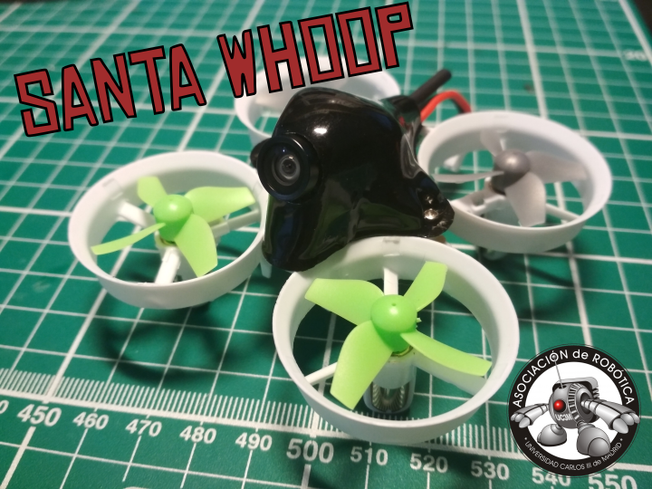

## Materiales

 - Drone Eachine E11c o JJRC H67 [link](https://www.xt-xinte.com/JJRC-H67-Flying-Santa-Claus-w-Christmas-Songs-RC-Quadcopter-Drone-Headless-Mode-Toys-RTF-for-Kids-Best-Gift-VS-H36-E011C-E010-p410672.html)
 - Cámara LST-S2+ [link](https://www.xt-xinte.com/FPV-AIO-Micro-Camera-5-8G-25MW-40CH-800TVL-Transmitter-LST-S2-FPV-Camera-w-OSD-p497464.html)
 - Canopy BetaFPV (opcional) [link](https://www.amazon.es/BETAFPV-Whoop-Plastic-Canopy-Black/dp/B07D7XL5NK)
 - Programador ST-Link V2 [link](https://es.aliexpress.com/store/product/1PCS-ST-LINK-Stlink-ST-Link-V2-Mini-STM8-STM32-Simulator-Download-Programmer-Programming-With-Cover/1095279_32792513237.html)

NOTA: Los links de compra son orientativos. En Xt-Xinte recordad que existe un cupón de 5$ cada vez que creas una cuenta, por lo que se recomienda pedir cada artículo desde diferentes cuentas.

## Hardware

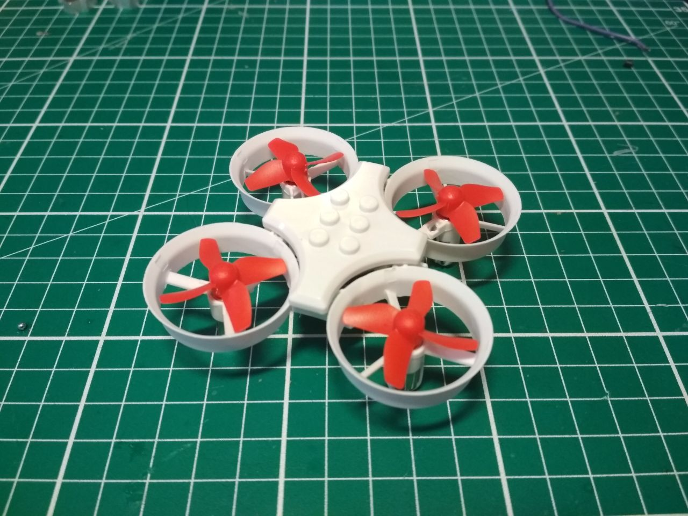

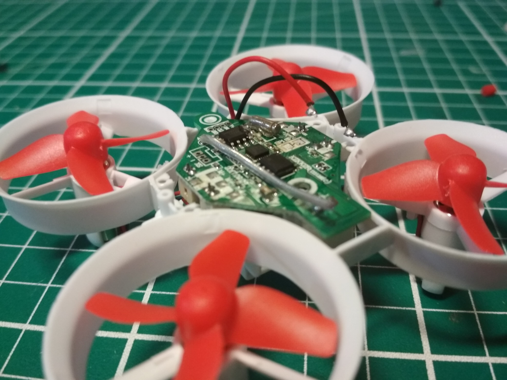

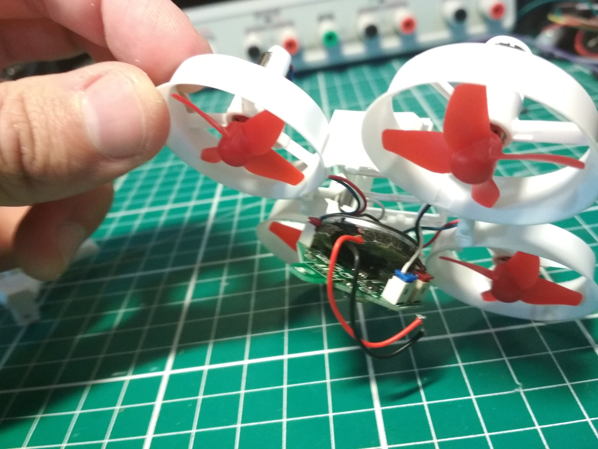

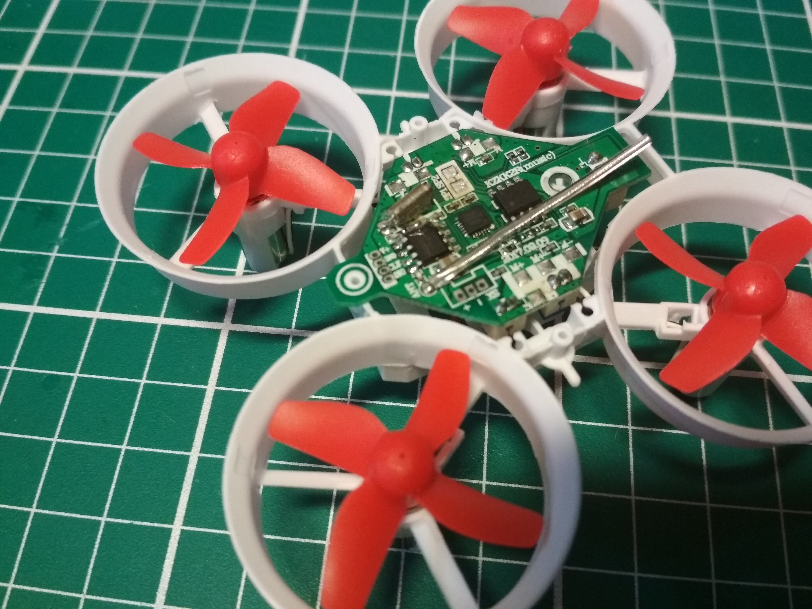

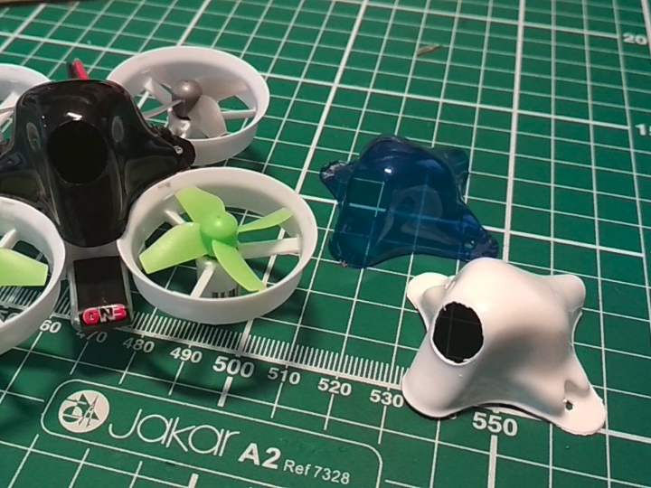

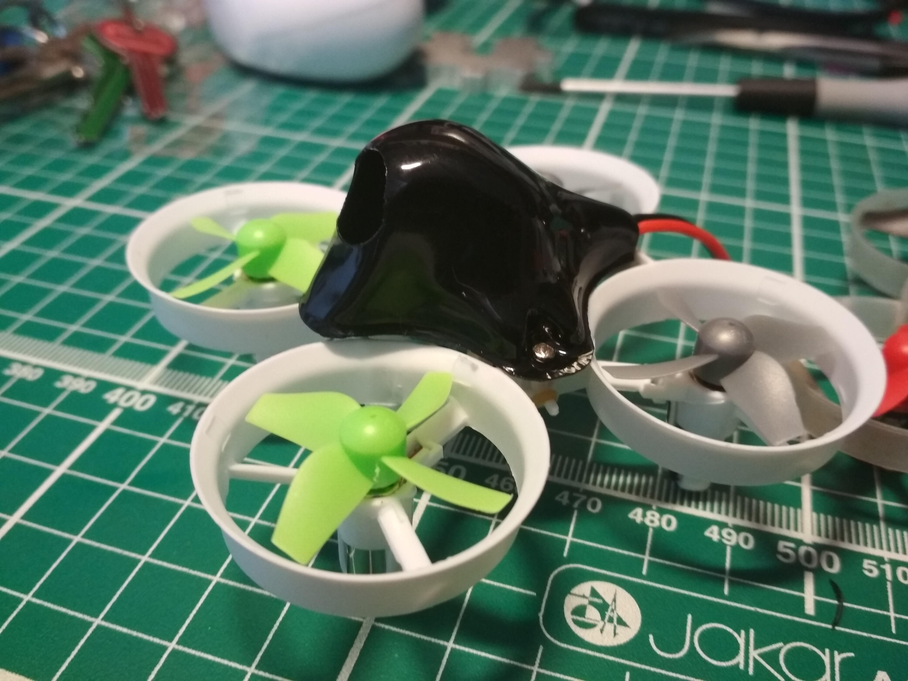

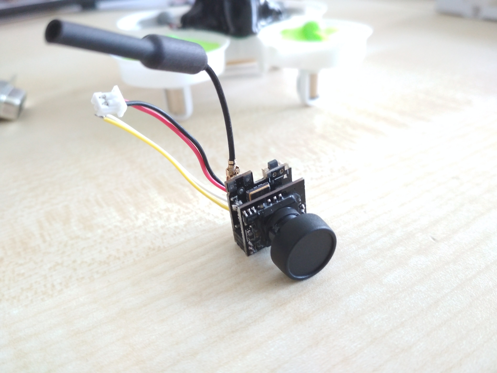

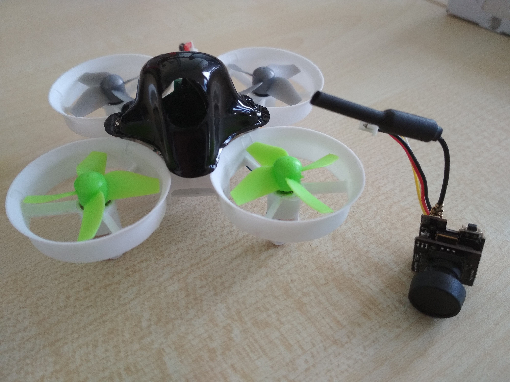

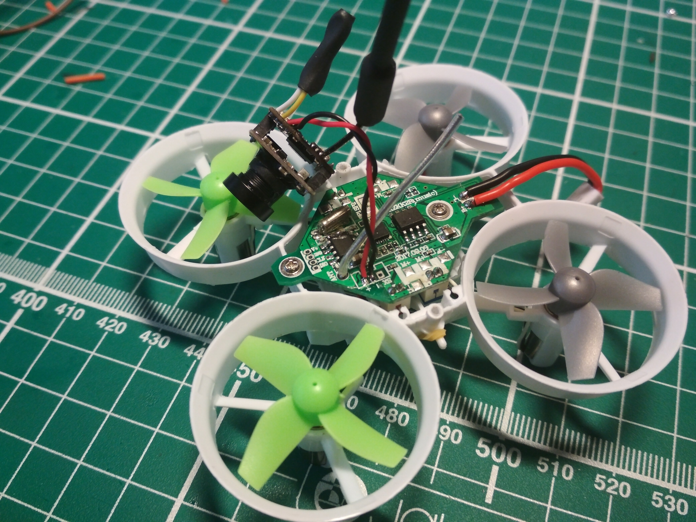

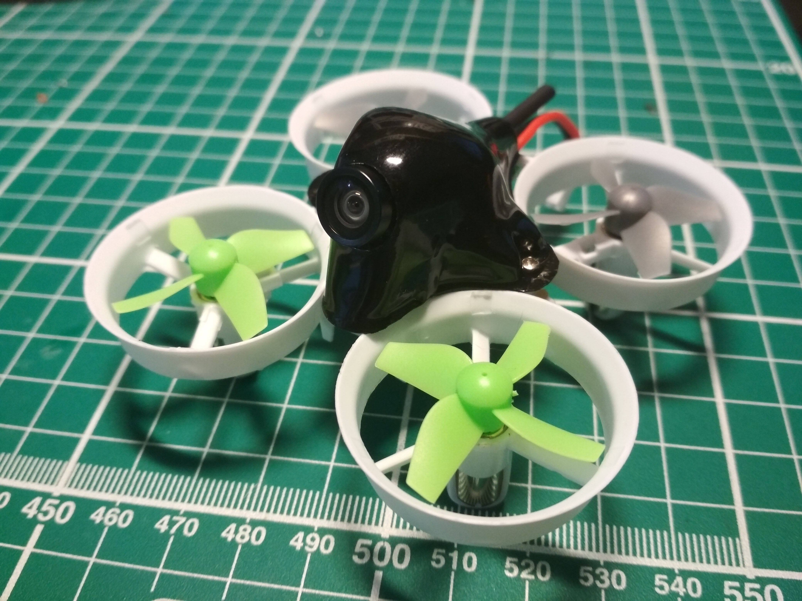

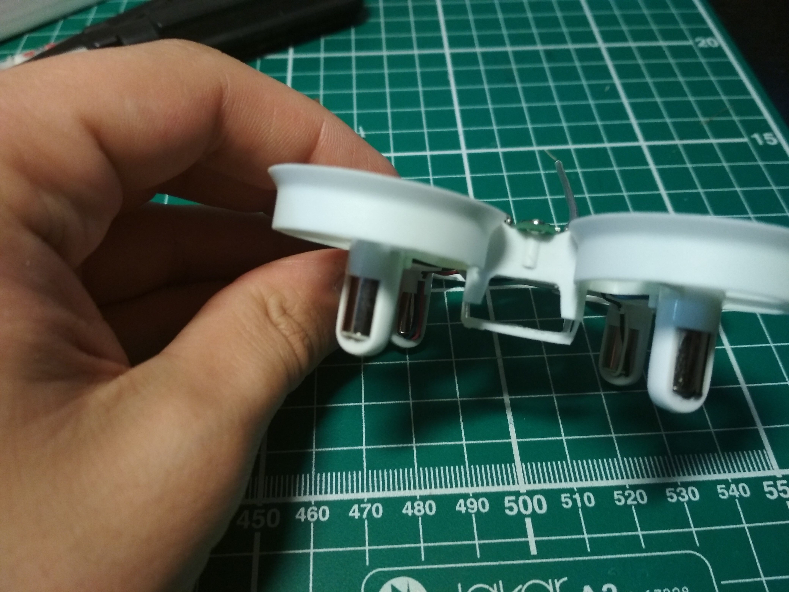

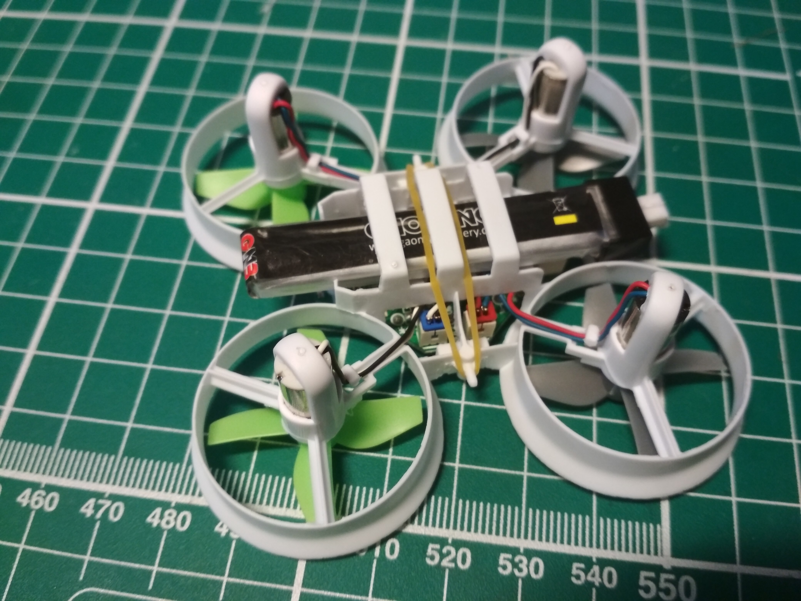

## Firmware
